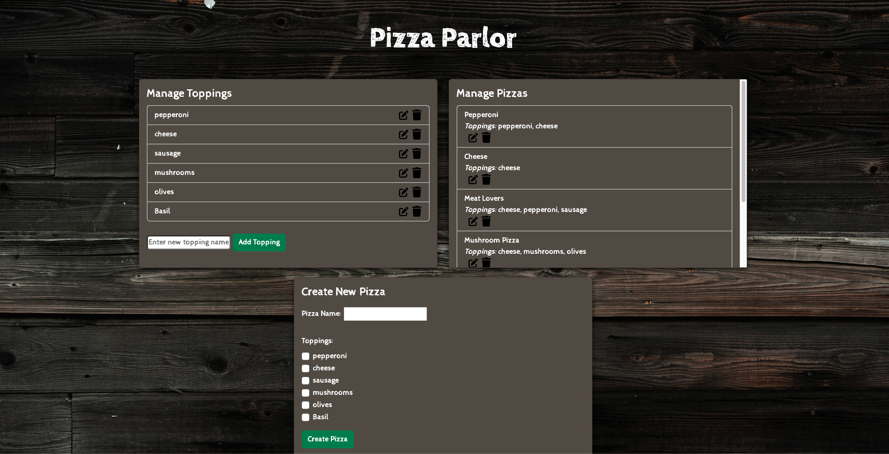
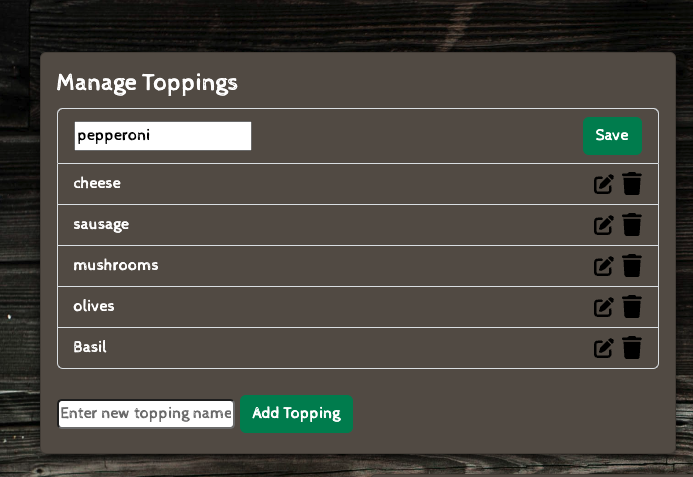
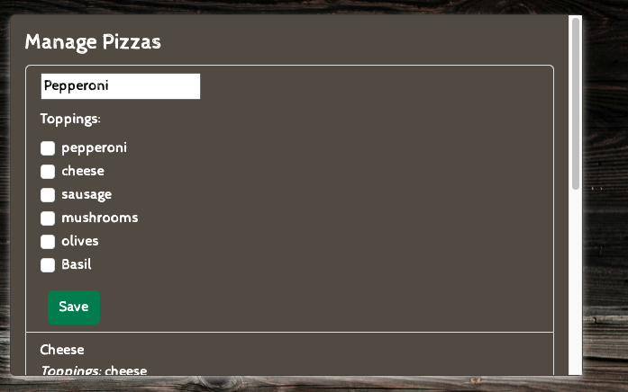
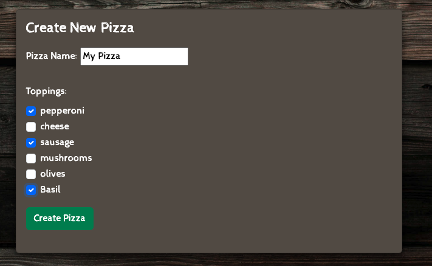

# Pizza Parlor
## Description
A pizza making application that lets the user manage toppings by creating, updating or deleting them. The user can also update or delete currently made pizzas or create their own pizza. This application was created using the MERN Stack with MongoDB as the database for storing all toppings and pizzas and React for displaying the content. Express.js and Node.js are running the server on the backend and Bootstrap was used to help style the components.
## Installation
To install the application locally, clone the repo to your local machine. Then, run the command npm install on both the client and server folders in your terminal. Next, run the command npm run develop on the root folder in your terminal to run both the front end and the backend at the same time. To run a test, open the server folder in your terminal and run the command npm test to test the backend API routes for retrieving data. 
Here is the deployed link to the application: https://pizza-parlor-cd2s.onrender.com/
## Usage
To use this application, you can start by editing or creating a pizza or topping of your choice. By clicking the buttons and following the prompts, you can create your pizza masterpiece in no time! The following screenshots show how it is used.
   
   
   
   
   
   
## License
N/A
---
